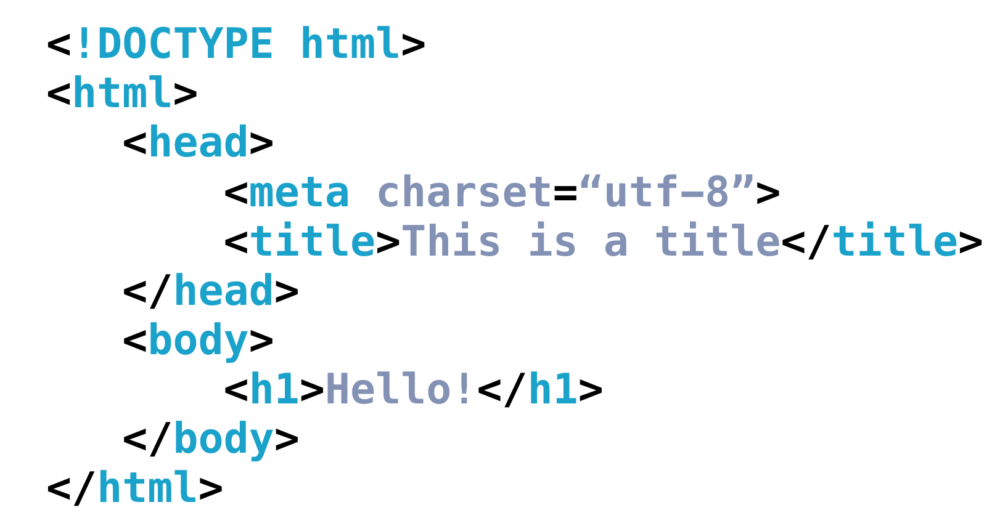

### HTML 文档类型

HTML 文档通常以类型声明开始（这不是标签，所以不应该有结束标签）。该声明将帮助浏览器确定其尝试解析和显示的 HTML 文档类型。

如果你曾经使用开发者工具查看[年代较早的一些网站](http://www.3riversstadium.com/index2.html)，你可能已注意到文档类型如下所示：

```html
<!DOCTYPE HTML PUBLIC "-//W3C//DTD HTML 4.01//EN\" \"http://www.w3.org/TR/html4/strict.dtd">
（触发标准模式，但指定旧形式的验证。）
```

或者你可能根本找不到文档类型的声明？

```html
<html>
    … 
</html>

（触发 "Quirks" 模式。真糟糕。）
```

但是较新的网站（以及你的网站！）将具有如下所示声明：

```
<!DOCTYPE html>

（拥有所有最新功能的触发标准模式。）😊
```

浏览器查找该文档类型声明来确定使用哪种**渲染模式**来渲染该站点。通常，较新的站点遵循标准 HTML 规范。当前的标准 HTML 规范被称为 HTML5（即你正在学习的内容！）。另一方面，在 HTML 标准发布之前创建的较早站点，可能使用不同的渲染模式模拟较早浏览器的行为。

如果你有兴趣阅读更多有关文档类型声明和不同渲染模式的内容，可以在 [此处](https://developer.mozilla.org/zh-CN/docs/%E6%80%AA%E5%BC%82%E6%A8%A1%E5%BC%8F%E5%92%8C%E6%A0%87%E5%87%86%E6%A8%A1%E5%BC%8F) 进行了解。

一旦你声明了文档类型，HTML 文档的下一部分就是 `<html>` 标签，告知浏览器应将括在 `<html> ...</html>` 内的所有内容解析为 HTML。然后是 HTML 文档的两个主要部分：`<head>` 和 `<body>`。


### `<head>` 和 `<body>`

`<head>`  将包含有关页面的常规信息和元数据，而 `<body>` 将包含显示在该页面上的内容。以下是整个 HTML 文档树结构的示例：


在本课程中学习的所有 HTML 语法将帮助你创建页面的**内容**，该内容始终包含在 `<body>` 标签内部。`<body>` 始终可见。

另一方面，`<head>` 是始终不可见的，但是其中描述页面的信息和指向其它文件的链接都是浏览器正确渲染网站所需要的。例如，`<head>`  负责：

- 文档的标题（浏览器标签中显示的文本）： `<title>About Me</title>`。
- 相关的 CSS 文件（针对样式）：`<link rel="stylesheet" type="text/css" href="style.css">`。
- 相关的 JavaScript 文件（更改渲染和行为的多用途脚本）：`<script src="animations.js"></script>`。
- 网页使用的字符集（文本的[编码](https://baike.baidu.com/item/%E5%AD%97%E7%AC%A6%E7%BC%96%E7%A0%81/8446880?fr=aladdin)）：`<meta charset="utf-8">`。
- 关键字、作者和描述（通常对[搜索引擎优化（SEO）](https://baike.baidu.com/item/%E6%90%9C%E7%B4%A2%E5%BC%95%E6%93%8E%E4%BC%98%E5%8C%96/3132?fr=aladdin) 起作用）： `<meta name="description" content="This is what my website is all about!">`。
- … 等！

现在，我们只关注这两个标签：

- `<title>About Me</title>`
- `<meta charset="utf-8">`

`<meta charset="utf-8">` 是十分标准的格式，它将允许你的网站显示任何 [Unicode 字符](https://unicode-table.com/cn/)。（[单击此处了解更多有关 UTF-8 的信息](https://baike.baidu.com/item/UTF-8/481798?fr=aladdin)。）`<title>` 将定义文档的标题，并在用户访问页面时显示在浏览器的标签中。

