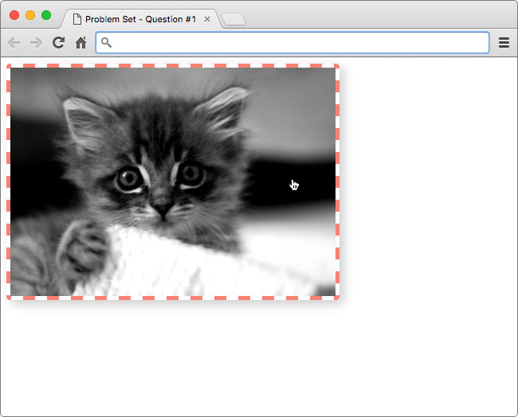
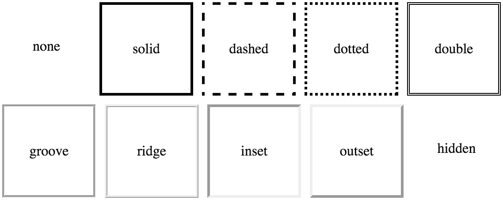

# 设计图片样式

在第一个练习中，我希望你为这张黑白的猫咪图像添加一些样式。


*啊，是不是超可爱！* 🐱

我会为你提供图像和 HTML，你只需要负责为该图像添加样式，但是，你不能任意的添加样式。相对的，你需要使用 `border`、`cursor` 和 `box-shadow` 属性，来得到下图中的效果：



*提示：边框的颜色为橙红色（#fa8072）*

### 边框

如果你曾在文字处理器或电子表格中使用过表格（table），那么你应该对边框很熟悉。通过 CSS，你可以为任何内容添加边框。有一大堆的选项可以用来定制边框比如样式、宽度和颜色！单击[此处](20.00-03-border.md)了解有关“CSS 边框”（CSS Borders）的更多内容。



*示例：可以使用 CSS 实现的各种边框样式*

### 光标

当你浏览一个网站时，你可能从来没有注意过光标的变化，因为这种改变很细微。但是，通过更改光标样式，向用户传达信息会非常有效。举个例子，如果用户将鼠标悬停在了一个链接上，此时改变光标样式变成指针，让用户知道这个链接可以被点击。


*左侧是一个普通按钮；右侧是鼠标悬停在它上面时的样子*

对于大多数情况，浏览器会自动更改光标，但是你可以使用光标属性来覆盖默认行为。请查看[此页面](20.00-03-光标.md)，了解所有起作用的光标！显然，该属性仅适用于使用 😉 鼠标的用户。

### Box-Shadow


*使用阴影为图片增加深度感*

`box-shadow` 属性是 CSS 里相对较新的一个属性，你可以使用该属性为元素添加阴影。如果希望试用 `box-shadows`，请在 CSS matic 中查看 [box-shadow 生成器](20.00-04-box-shadows.md)（Box-Shadow Generator）。

### 如何完成此练习

在优达学城课堂中编辑 `index.html`，以得到与解决方案图片（下图）完全一致的样式。


我已经提供了代码的**选择器**部分，你只需填充样式。你可以点击“测试答案”，预览你的代码的效果。

```css
.猫咪图像 {
  /* 在此处添加 CSS */
  .kitten-image {
  border: 5px dashed salmon;
  border-radius: 5px;
  cursor: pointer;
  box-shadow: 5px 5px 20px #ccc;
}
}
```
