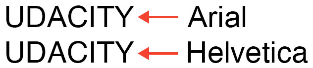

# 设计字体样式

在本练习中，你将练习为下方的“udacity”文本添加字体样式。


*看起来相当呆板！*

与上个练习相同，我会为你提供 HTML，而你需要添加样式。你将需要使用与 `font` 和 `text` 相关的属性生成以下结果。


*提示：字体颜色为紫色阴影（#8001ff）*

## 字体

使用 Web 上的字体时，必须首先考虑哪些字体可供用户使用。每个操作系统（不论是 Windows、OS X 还是 Linux）都附带一组预先安装的字体，你可以使用这些字体来定制你的网站。 

实现方式相当简单。使用 `font-family` 属性时，指定希望在 HTML 中使用的字体。

```css
font-family：font1、font2、font3 ...；
```

然后，浏览器开始从左到右查看指定字体，以检查是否可以使用你所提供的字体去渲染文本。如果无法使用第一种字体，浏览器会尝试下一种字体，以此类推。

指定多个字体的目的是，因为并非所有字体在每个操作系统上都适用。因此，指定多种相似字体，可以确保用户无论使用哪种操作系统，都可以获得一致的体验。



*比较 Arial 与 Helvetica 字体*

在解决方案中，我指定了 `font-family:Helvetica, Arial, sans-serif;`。因此，浏览器首先尝试渲染  Helvetica 字体。在 Mac 上也同样适用，因为 Helvetica 是随操作系统一起打包提供的标准字体。但是，在 Windows 和  Linux 机器上，默认情况下这些操作系统可能（无法）支持 Helvetica 字体，因此浏览器会尝试使用 Arial 字体。如果没有  Arial 字体，则浏览器将使用任何可用的 sans-serif 字体。

## 自定义字体

还可以在 Web 上使用自定义字体。如果你想继续并开始体验，可以参阅 [Google 字体](http://www.googlefonts.cn/) 来查看起作用的某些开源 Web 字体！如果使用自定义 Web 字体，则无需像上述步骤一样指定多个字体，但是至少指定一个备用字体仍然是明智的选择，以防未加载自定义字体。

## 如何完成此练习

在教室中编辑 `index.html` 以复制与解决方案图片中所显示样式相同的样式设置。


此外，我已写好带有空声明块的**选择器**，你可以添加你的更改。不客气！😉。

```css
.udacity-text {
  font-family: Helvetica, Arial, sans-serif;
  font-size: 60px;
  text-transform: uppercase;
  text-decoration: underline;
  color: #8001ff;
}
```

准备好之后，单击“开始练习”开始。你可以点击“测试答案”，预览你的代码的效果。