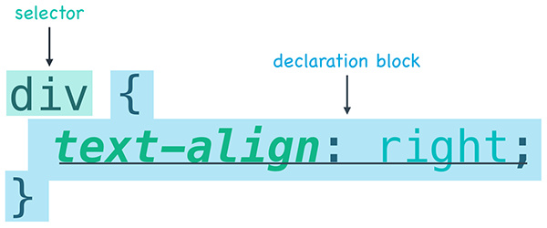

- [MDN 选择器](https://developer.mozilla.org/zh-CN/docs/Web/Guide/CSS/Getting_started/Selectors)

- [CSS 选择器的原理](https://css-tricks.com/how-css-selectors-work/)(英) | [翻译参考](https://zhuanlan.zhihu.com/p/26213764)

  

# 编写选择器

现在，你应该已经熟悉 CSS 语句的基本结构。每个 CSS 语句都由一个**选择器（selector）**和一个**声明块（declaration block）**组成。选择器告诉浏览器，我们要为哪些 HTML 元素设计样式，声明块则告诉浏览器需要将哪些样式应用于该 HTML。



## CSS 语句的基本结构

在本练习中，我希望你仅关注 CSS 语句的选择器部分。为此，我创建了一个缺少样式的网页。网页中的 HTML 已经添加了 ID 和类，但是它缺少添加样式的合适选择器。

```css
<div id="menu">
  <h1 class="item">Chicken Clay Pot</h1>
  
  <p class="description">Crispy rice baked in clay pot topped with chicken and vegetables</p>
</div>
```

```css
/* 缺少的 ID */ {
  text-align: center;
}
/* 缺少的类 */ {
  color: red;
}
/* 缺少的类 */ {
  border-radius: 5px;
}
/* 缺少的类 */ {
  font-style: italic;
}
```

你负责下载网页并填写缺少的选择器。如果操作正确，你的网页最终应如下所示...

