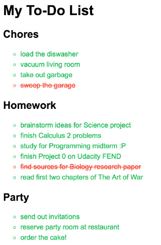

使用选择器向 HTML 添加样式是最快速且最有效的方法。现在，你只练习过使用**标签**、**ID** 和**类**选择器，但实际上还存在其他类型的选择器。如果你希望继续阅读，可以参阅以下链接。

- [MDN 选择器](https://developer.mozilla.org/zh-CN/docs/Web/Guide/CSS/Getting_started/Selectors)
- [CSS 选择器的原理](https://css-tricks.com/how-css-selectors-work/)(英) | [翻译参考](https://zhuanlan.zhihu.com/p/26213764)

我们将在后续课程中对这些内容作进一步讲解。

现在，可以就你对**属性**知识点的掌握情况进行测试。在本练习中，我创建了 HTML 形式的简单待办事项列表，并编写 CSS 以对其进行样式设置 😃。



但在 HTML 中你将会看到 HTML 中缺少某些 **ID** 和**类**属性。要完成本测试，应向 HTML 添加正确的 **ID** 和**类**属性以复制下列待办事项列表。

## 如何完成这个练习

1. 在下一页的 Workspace 中编辑 `index.html` ，重现解决方案图像。
2. 你需要将正确的 **id** 和 **类** 属性添加到 HTML 元素以重现解决方案图像。
3. 当你完成后点击 `solution.html` ，看看我是如何做到的。


```html
<!DOCTYPE html>
<!-- 说明：请使用我们提供的 HTML 和 CSS，为 HTML 添加正确的属性，使你呈现的结果与上一个页面中的答案相同。 

你可以随时返回上一页查看答案，workspace 将自动保存你的进度！
-->
<html>
<head>
	<meta charset="utf-8">
	<title>练习：使用属性</title>
	<style>
        body {
            font-family: Arial; 
        }
        #to-do-list {
            width: 400px;
            background: #2e3d49;
            padding: 10px 20px;
        }
        .title {
            color: #fff;
        }
        .underline {
            text-decoration: underline;
        } 
        .list {
            list-style-type: circle;
            text-align: left;
            font-size: 16px;
            color: #1fba58;
            line-height: 24px;
        }
        .finished {
            color: #f4442f;
            text-decoration: line-through;
        }
	</style>
</head>
<body>
	<div id="to-do-list">
		<h1 class="title">我的待办事项列表</h1>
		<h2 class="underline title">家务</h2>
		<ul class="list">
			<li>把碗碟放进洗碗机</li>
			<li>用吸尘器打扫起居室</li>
			<li>倒垃圾</li>
			<li class="finished">清扫车库</li>
		</ul>
		<h2 class="underline title">家庭作业</h2>
		<ul class="list">
			<li class="finished">针对科学项目开动脑筋</li>
			<li class="finished">解决 2 个微积分的问题</li>
			<li>学习以准备编程期中考试 :P</li>
            <li>完成优达学城前端开发（入门）的项目 0</li>
			<li class="finished">查找生物学研究报告的来源</li>
			<li>阅读《战争的艺术》的前两章</li>
		</ul>
        <h2 class="underline title">开派对</h2>
        <ul class="list">
            <li class="finished">发出邀请</li>
            <li>在酒店预订派对房间</li>
            <li>订购蛋糕！</li>
        </ul>
	</div>
</body>
</html>
```

